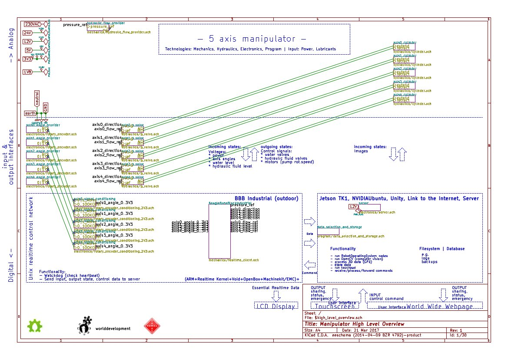
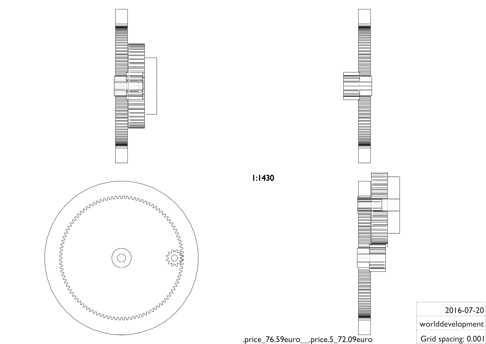

Robotic Manipulator
===

The pivot of many machines of the world development global village construction set.

Core
---
* scalable (scale up to use for forest work, as crane or defense herc)
* hydraulic (electrical delivered too little payload for DIY heavy duty transmission)

High Level Overview
---

Developers:
---
worlddevelopment e.V. & other world citizens

